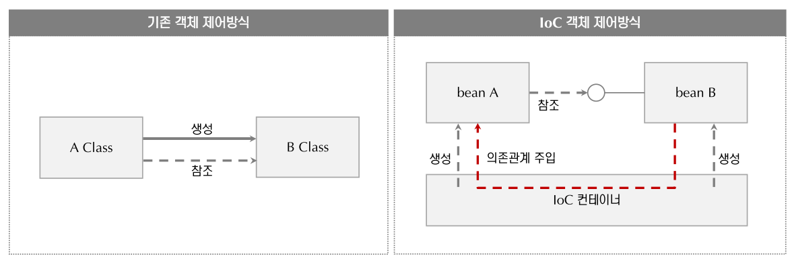

해당 Repo는 [여기](https://www.youtube.com/playlist?list=PLOSNUO27qFbsW_JuXmzrFxPw7qzPOFfQs)를 보고 공부하였습니다.

# 공부기록

프로젝트는 spring5, maven으로 진행.

## 2-1, 2-2
UML entities, services, stores 정의

## 2-3 
pom.xml은 maven의 기본설정을 담고 있다.
그룹id, 아티팩트id, 버전정보
프로퍼티와 사용하는 라이브러리(dependency)가 있다.

첫번째는 Spring core(IoC를 사용하기 위한 Spring core라이브러리)가 있다.
두번째는 lombok 이며 생산성을 위해 사용하는 도구
set, get 메서드, 생성자 클래스를 만들때 사용하는 코드들.

인텔리제이 우측에 maven항목에 Lifesycle, Plugins, Dependencies가 있다.
Dependencies에 spring-context에 다양한 라이브러리 가 있다.


## 2-4
store.mapstore.ClubMapStore 클래스 구현

## 2-5

### IoC 컨테이너
```java
// ClubServiceLogic.java
public class ClubServiceLogic implements ClubService {
    private ClubStore clubstore;

    public ClubServiceLogic() {
        this.clubStore = new ClubMapStore();
    }
    
    // ...
}
```
위의 방식처럼 작성하면 ClubServiceLogic과 ClubMapStore클래스의 관계가 타이트해진다. (tight coupling)
위의 코드에서 Map에다가 데이터를 저장했는데 DB에 저장하고 싶어 클래스를 변경하게 된다면 (ClubMapStore -> ClubDBStore)
ClubMapStore와 연관된 클래스들을 전부 수정해 주어야 한다.

그래서 이런 부분을 Spring이 가지고 있는 IoC 컨테이너를 이용하면 객체의 생성부터 관계를 구성할 수 있다.(dependencies)
즉, ClubServiceLogic이 ClubMapStore을 알게 하는 이 관계까지도 IoC 컨테이너한테 맡길 수 있다.
(IoC: 제어의 역전 -> 개발자가 new하지 않고 IoC 컨테이너에 의해 new가 돼서 객체도 생성이 된다. 또한 관계들도 구성을 해준다는 의미가 IoC의 내용이다.)

### Spring bean


객체 생성을 IoC 컨테이너에 맡기려면 그 대상이 되는 클래스들을 등록해야한다.
이렇게 등록된 클래스들을 Spring bean이라고 한다.
(스프링의 IoC 컨테이너에 의해 관리되어지는 클래스들을 bean 클래스라고 한다 = bean객체)

위의 그림을 통해 본 프로젝트를 생각해본다면 bean A는 ClubServiceLogic, bean B는 ClubMapStore, 가운데 참조는 ClubStore 인터페이스를 나타낸다.
ClubServiceLogic에서는 ClubMapStore를 모른다. 
대신 ClubSore의 인터페이스만 알고있는 상태가 된다.
IoC 컨테이너에다가 ClubMapStore를 bean으로 등록을 하면 ClubMapStore를 사용해야되는 시점에 생성하고 그리고 그 생성된 인스턴스 정보를 주입한다
=> 이를 의존관계 주입이라 한다.

IoC컨테이너에 의해 의존관계를 주입하는 방식을 DI방식이라고 한다. 
이 방식은 두가지가 있다 DI가 있고 DL방식이 있다. 
요즘은 DL 방식을 대부분 사용하지 않아 보통 IoC DI라고 이야기한다. 

ClubMapStore를 ClubServiceLogic이 알게 하고 사용할수 있게끔 해주고 싶다면 
첫째 Spring IoC컨테이너로 하여금 ClubMapStore가 bean객체라는 것을 알 수 있도록 등록하는 작업이 필요하다.
둘째 등록된 ClubMapStore는 ClubServiceLogic이 참조해서 사용할 수 있도록 의존관계를 주입해 줘야한다. 

과거 스프링2 버전에서는 applicationContext.xml과 같은 곳에 bean을 생성해서 하나씩 등록해주었다.
최신 스프링5 버전에서는 어노테이션등 과같은 방법을 사용하여 bean을 등록한다
먼저 어떻게 의존성 관계를 주입하는지, Ioc의 이해하기 위해 과거에 사용했던 bean객체를 직접 등록하는과정을 수행해 볼 것이다.
(xml로 어떤 클래스가 무슨id를 갖는 bean이다 라고 일일이 bean을 등록해 주는 방식)

먼저 id를 부여하고 클래스를 지정한다.
```xml
<!-- applicationContext.xml -->
<bean id="clubStore" class="io.travelclub.spring.store.mapstore.ClubMapStore"/>

<bean id="clubService" class="io.travelclub.spring.service.logic.ClubServiceLogic">
<!--    clubServer를 bean으로 등록하면서 생성자의 파라미터로 -->
<!--    clubStore의 아이디를 갖는 bean을 주입하겠다 -->
    <constructor-arg ref="clubStore"/>
</bean>
```
다음과 같이 수정한다. 
```java
// ClubServiceLogic.java
public class ClubServiceLogic implements ClubService {
    private ClubStore clubstore;

    /* ClubServiceLogic이 생성되는 시점에 생성자를 호출하면서 
       ClubMapStore를 new 해서 여기에다가 파라미터로 넘겨 준다. */
    public ClubServiceLogic(ClubStore clubStore) {
        this.clubStore = clubstore;
    }
    
    // ...
}
```
즉, ClubMapStore를 bean으로 등록을 했다.<br>
설정에서 보면 ClubStore, ClubService를 bean으로 등록을 했다.<br>
ClubService가 사용되는 시점에 생성자에서 레퍼런스하고 있는 ClubStore라는 id를 갖는 이 클래스를 주입해 주세요 라는 의미이다.<br>
이 ClubServiceLogic의 입장에서는 이 ClubStore 인터페이스가 참조하고 있는 객체가 ClubMapStore인지 ClubDBStore인지는 상관이 없다.<br>
알아서 주입이 되기 때문이다. <br>
해당 내용은 applicationContext.xml파일이 이 설정의 정보를 보고나서 주입이 된 것이다.
bean 으로 등록할 때는 이렇게 "이 특정 설정 파일에다가 어떤 bean을 쓰겠다."
라고 이렇게 등록을 해주면 IoC 컨테이너가 이 내용을 읽어서
객체의 생성부터 관계의 구성까지 다 해주는 것이다.
이 역할을 IoC 컨테이너가 하는것이다. <br>

(bean 객체를 생성하고 하는 부분들도 BeanFactory 라고 하는 Spring의 라이브러리 중에 특정 BeanFactory 클래스가 그런 작업들을 진행을 한다.)
