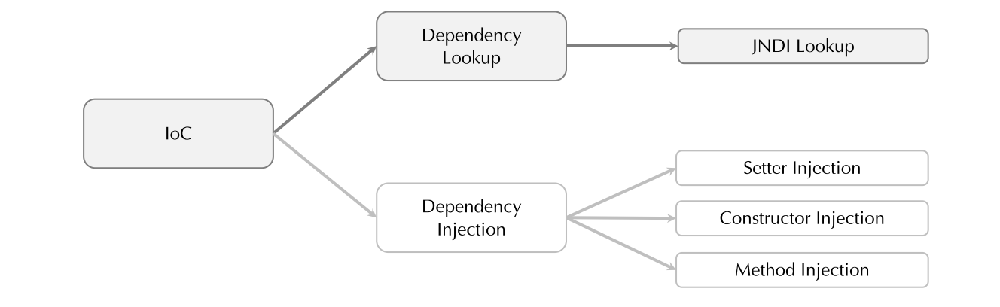
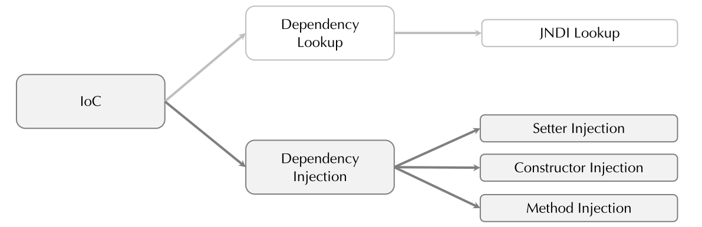
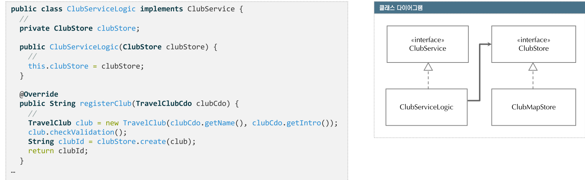
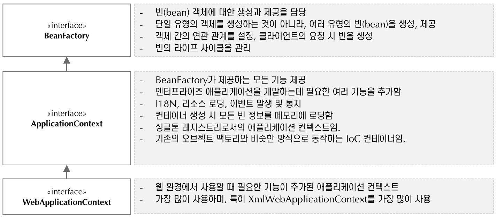

해당 Repo는 [여기](https://www.youtube.com/playlist?list=PLOSNUO27qFbsW_JuXmzrFxPw7qzPOFfQs)를 보고 공부하였습니다.

# 공부 기록

프로젝트는 spring5, maven으로 진행.

- ch2의 목표: Spring IoC 컨테이너를 이용해서 Spring Bean 으로 등록하고 사용하고 DI 가 적용되는 부분들을 직접 코드로 확인
## 2-1, 2-2
UML entities, services, stores 정의

## 2-3 
pom.xml은 maven의 기본설정을 담고 있다.
그룹id, 아티팩트id, 버전정보,
프로퍼티와 사용하는 라이브러리(dependency)가 있다.

첫번째는 Spring core(IoC를 사용하기 위한 Spring core라이브러리)가 있다.<br>
두번째는 lombok 이며 생산성을 위해 사용하는 도구<br>
set, get 메서드, 생성자 클래스를 만들때 사용하는 코드들.

인텔리제이 우측에 maven항목에 Lifesycle, Plugins, Dependencies가 있다.<br>
Dependencies에 spring-context에 다양한 라이브러리 가 있다.


## 2-4
store.mapstore.ClubMapStore 클래스 구현

## 2-5

### IoC 컨테이너
```java
// ClubServiceLogic.java
public class ClubServiceLogic implements ClubService {
    private ClubStore clubstore;

    public ClubServiceLogic() {
        this.clubStore = new ClubMapStore();
    }
    
    // ...
}
```
위의 방식처럼 작성하면 ClubServiceLogic과 ClubMapStore클래스의 관계가 타이트해진다. (tight coupling)
위의 코드에서 Map에다가 데이터를 저장했는데 DB에 저장하고 싶어 클래스를 변경하게 된다면 (ClubMapStore -> ClubDBStore)
ClubMapStore와 연관된 클래스들을 전부 수정해 주어야 한다.

그래서 이런 부분을 Spring이 가지고 있는 IoC 컨테이너를 이용하면 객체의 생성부터 관계를 구성할 수 있다.(dependencies)
즉, ClubServiceLogic이 ClubMapStore을 알게 하는 이 관계까지도 IoC 컨테이너한테 맡길 수 있다.
(IoC: 제어의 역전 -> 개발자가 new하지 않고 IoC 컨테이너에 의해 new가 돼서 객체도 생성이 된다. 또한 관계들도 구성을 해준다는 의미가 IoC의 내용이다.)

### Spring bean


객체 생성을 IoC 컨테이너에 맡기려면 그 대상이 되는 클래스들을 등록해야한다.
이렇게 등록된 클래스들을 Spring bean이라고 한다.
(스프링의 IoC 컨테이너에 의해 관리되어지는 클래스들을 bean 클래스라고 한다 = bean객체)

위의 그림을 통해 본 프로젝트를 생각해본다면 bean A는 ClubServiceLogic, bean B는 ClubMapStore, 가운데 참조는 ClubStore 인터페이스를 나타낸다.
ClubServiceLogic에서는 ClubMapStore를 모른다. 
대신 ClubSore의 인터페이스만 알고있는 상태가 된다.
IoC 컨테이너에다가 ClubMapStore를 bean으로 등록을 하면 ClubMapStore를 사용해야되는 시점에 생성하고 그리고 그 생성된 인스턴스 정보를 주입한다
=> 이를 의존관계 주입이라 한다.

IoC컨테이너에 의해 의존관계를 주입하는 방식을 DI방식이라고 한다. 
이 방식은 두가지가 있다 DI가 있고 DL방식이 있다. 
요즘은 DL 방식을 대부분 사용하지 않아 보통 IoC DI라고 이야기한다. 

ClubMapStore를 ClubServiceLogic이 알게 하고 사용할수 있게끔 해주고 싶다면 
첫째 Spring IoC컨테이너로 하여금 ClubMapStore가 bean객체라는 것을 알 수 있도록 등록하는 작업이 필요하다.
둘째 등록된 ClubMapStore는 ClubServiceLogic이 참조해서 사용할 수 있도록 의존관계를 주입해 줘야한다. 

과거 스프링2 버전에서는 applicationContext.xml과 같은 곳에 bean을 생성해서 하나씩 등록해주었다.
최신 스프링5 버전에서는 어노테이션등 과같은 방법을 사용하여 bean을 등록한다
먼저 어떻게 의존성 관계를 주입하는지, Ioc의 이해하기 위해 과거에 사용했던 bean객체를 직접 등록하는과정을 수행해 볼 것이다.
(xml로 어떤 클래스가 무슨id를 갖는 bean이다 라고 일일이 bean을 등록해 주는 방식)

먼저 id를 부여하고 클래스를 지정한다.
```xml
<!-- applicationContext.xml -->
<bean id="clubStore" class="io.travelclub.spring.store.mapstore.ClubMapStore"/>

<bean id="clubService" class="io.travelclub.spring.service.logic.ClubServiceLogic">
<!--    clubServer를 bean으로 등록하면서 생성자의 파라미터로 -->
<!--    clubStore의 아이디를 갖는 bean을 주입하겠다 -->
    <constructor-arg ref="clubStore"/>
</bean>
```
다음과 같이 수정한다. 
```java
// ClubServiceLogic.java
public class ClubServiceLogic implements ClubService {
    private ClubStore clubstore;

    /* ClubServiceLogic이 생성되는 시점에 생성자를 호출하면서 
       ClubMapStore를 new 해서 여기에다가 파라미터로 넘겨 준다. */
    public ClubServiceLogic(ClubStore clubStore) {
        this.clubStore = clubstore;
    }
    
    // ...
}
```
즉, ClubMapStore를 bean으로 등록을 했다.<br>
설정에서 보면 ClubStore, ClubService를 bean으로 등록을 했다.<br>
ClubService가 사용되는 시점에 생성자에서 레퍼런스하고 있는 ClubStore라는 id를 갖는 이 클래스를 주입해 주세요 라는 의미이다.<br>
이 ClubServiceLogic의 입장에서는 이 ClubStore 인터페이스가 참조하고 있는 객체가 ClubMapStore인지 ClubDBStore인지는 상관이 없다.<br>
알아서 주입이 되기 때문이다. <br>
해당 내용은 applicationContext.xml파일이 이 설정의 정보를 보고나서 주입이 된 것이다.
bean 으로 등록할 때는 이렇게 "이 특정 설정 파일에다가 어떤 bean을 쓰겠다."
라고 이렇게 등록을 해주면 IoC 컨테이너가 이 내용을 읽어서
객체의 생성부터 관계의 구성까지 다 해주는 것이다.
이 역할을 IoC 컨테이너가 하는것이다. <br>

(bean 객체를 생성하고 하는 부분들도 BeanFactory 라고 하는 Spring의 라이브러리 중에 특정 BeanFactory 클래스가 그런 작업들을 진행을 한다.)

## 2-6

### bean 객체가 등록되었는지 확인
travelclub 패키지에 테스트를 위한 TravelClubApp 클래스 생성
```java
public class TravelClubApp {
    public static void main(String[] args) {
        // ClassPathXmlApplicationContext정보를 읽어온다. (applicationContext.xml로 설정정보를 읽어오겠다)
        ApplicationContext context = new ClassPathXmlApplicationContext("applicationContext.xml");

        // 실제로 bean이 등록되었는지 확인
        String[] beanNames = context.getBeanDefinitionNames();
        // bean의 id들이 출력될 것이다.
        System.out.println(Arrays.toString(beanNames));
        // 실행하면 [clubStore, clubService] 두개의 bean이 이상없이 등록됨을 확인할 수 있다.
    }
}
```
설정하는 방법은 자바클래스 또는 ClassPathXmlApplicationContext 이외의 다른 클래스들도 존재한다.<br> 

그런데 앞서 2-6방법처럼 클래스들을 일일이 bean 태그로 만들기에는 어려움이 있다. <br>
스프링에는 context에 component-scan과 base-package라는 걸 지정해 준다.
```xml
    <!--    base-package가 되는 곳에서부터 하위로 내려가면서 컴포넌드들 즉, bean들을 scan하라는 의미-->
    <context:component-scan base-package="io.travelclub.spring"/>
```
일일이 자기가 bean 으로 등록해주지 않고 특정 패키지부터 bean 들을 찾아라 라는 의미이다.

실행하면 다음 결과가 나온다.
```
[org.springframework.context.annotation.internalConfigurationAnnotationProcessor, 
org.springframework.context.annotation.internalAutowiredAnnotationProcessor, 
org.springframework.context.event.internalEventListenerProcessor, 
org.springframework.context.event.internalEventListenerFactory]
```
아까 등록해두었던 bean들은 등록이 안되어있고 spring framework의 bean들이 출력됨을 확인할 수 있다. <br>
왜냐하면 ClubMapStore 나 ClubServiceLogic 이나 다 bean 으로 등록이 되어야 하는데
이 bean 들을 어떻게 등록하는지를 지정을 안해놓았다.<br>
그래서 ClubMapStore 나 Entity 클래스들이나 지금 모두 다 똑같은 클래스이기 때문에 bean 으로 등록이 안된다.<br> 
이럴 때 bean 으로 등록하는 방법은 bean으로 사용되는 각 클래스에다가 어노테이션을 넣어 준다.
<br><br>
각 클래스 위에 어노테이션을 지정해 보았다.
```java
@Service
public class ClubServiceLogic implements ClubService {
    // ...
}
```

```java
@Repository
public class ClubMapStore implements ClubStore {
    // ...
}

```
이렇게 어노테이션을 등록을 하면<br>
실제로 ClubServiceLogic 과 ClubMapStore 는 Spring bean 으로 등록되는 클래스가 된다. 
```
[clubServiceLogic, 
clubMapStore, 
org.springframework.context.annotation.internalConfigurationAnnotationProcessor, 
org.springframework.context.annotation.internalAutowiredAnnotationProcessor, 
org.springframework.context.event.internalEventListenerProcessor, 
org.springframework.context.event.internalEventListenerFactory]
```
별도의 id 를 지정해 주지 않았기 때문에 실제로 클래스명이 id 로 사용되는 형태를 알 수 있다.<br>
만약 이걸 별도의 id 로 등록하려면, 어노테이션에 문자열로 이름을 넣으면 된다. 
```java
@Repository("ClubStore")
public class ClubMapStore implements ClubStore {
    // ...
}
```

등록이 완료되었으니 사용을 해보자. <br>
실제 service의 create메서드를 호출해서 사용할 것이다.<br>
먼저 clubServiceLogic의 registerClub를 구현한다. 
```java
@Service("clubService")
public class ClubServiceLogic implements ClubService {
    @Override
    public String registerClub(TravelClubCdo club) {
        TravelClub newClub = new TravelClub(club.getName(), club.getIntro());
        newClub.checkValidation();
        return clubStore.create(newClub);
    }
}
```
파라미터에 TravelClubCdo 클래스가 입력된다.<br>
(cdo: Create Domain Object)<br>
(sdo: Service Domain Object) <br>
cdo는 create될 때 필요한 데이터들을 별도의 Domain Object에 나눠놓은 것이다.<br>


```java
public class TravelClubApp {
    public static void main(String[] args) {
        // ClubServiceLogic에 register를 구현하고 TravelClub에서 실제로 register를 하는 과정
        TravelClubCdo clubCdo = new TravelClubCdo("TravelClub", "Test TravelClub");
        // Spring 컨테이너로 하여금 bean 을 생성하게하고 그 bean 을 찾아오는 코드
        ClubService clubService = context.getBean("clubService", ClubService.class);
    }
}
```

### 왜 Clubservice.class를 받아올까? (강의 댓글 복사)
getBean() 메소드는  Spring이 제공하는 BeanFactory가 정의하고 있는 메소드로 getBean(String name), getBean(String name, Class<T> requiredType) 등  5개의 메소드가 오버로딩 되어 있습니다. 이중에서 예제에서 사용한 메소드는 getBean(String name, Class<T> requiredType) 형태의 메소드 입니다. 여기서 궁금하신 부분이 바로 두번째 파라미터 requiredType 일텐데요. getBean() 메소드의 목적은 컨테이너로부터 정확한 빈객체를 가져올 수 있도록 하는 것인데요.

만일 getBean(String name)이라는 메소드를 이용 한다면 "clubService"라는 등록한 빈의 이름만 가지고도 빈객체를 가져올 수 있습니다. 다만, 이렇게 이름만 가지고 빈객체를 요청했을 때 발생할 수 있는 예외는 해당 "이름"으로 등록된 빈이 없거나(NoSuchBeanDefinitionException), 빈 객체를 가져올 수 없는(BeansException) 두 가지 밖에 없습니다.

이렇게 발생할 수 있는 예외를 좀더 세분화해서 만약 빈을 찾지 못했다면, "이름"이 문제인지 아니면 찾아온 빈의 타입이 맞지 않는 것인지로 좀더 세분화 할 수 있게 하기 위해 getBean(String name, Class<T> requiredType) 이 메소드를 사용한 것입니다. 아무래도 이부분에서 헷갈리시는 부분이 ClubServiceLogic.class가 아니고 ClubService.class 인지 이실텐데요. 만약 ClubServiceLogic.class가 되려면 ClubServiceLogic clubService = context.getBean(...)과 같은 코드가 되어야 할텐데 이렇게 되면 빈으로 등록할 필요도 없어지겠죠. 그냥 new를 하면 될테니까요. 따라서 ClubService clubService = context.getBean(...)은 ClubService 인터페이스를 implements한 빈을 반환하는 것이 됩니다. 모든 예제 코드가 그렇지만 ClubService 인터페이스를 implements한 빈 객체는 ClubServiceLogic가 유일합니다.

끝으로 getBean() 메소드에 대한 API 설명 중에서 파라미터에 대한 설명들을 함께 올려드립니다. 이해에 도움이 되셨으면 좋겠습니다.

Parameters :
name - the name of the bean to retrieve
requiredType - type the bean must match; can be an interface or superclass


## 2-7
ClubSerivceLogic클래스의 findClubById, findClubsByName, modify, remove 메서드 구현<br>

mainApp클래스에서 findByClubId까지 해서 실제로 해당 데이터가 존재하는지 확인할 것이다.
```java
public class TravelClubApp {
    public static void main(String[] args) {
        String clubId = clubService.registerClub(clubCdo);

        TravelClub foundecClub = clubService.findClubById(clubId);

        System.out.println("Club name " + foundecClub.getName());
        System.out.println("Club intro " + foundecClub.getIntro());
        System.out.println("Club foundationTime " + new Date(foundecClub.getFoundationTime()));
    }
}
/*output
...
Club name TravelClub
Club intro Test TravelClub
Club foundationTime Tue Jun 28 14:40:36 KST 2022
 */
```
IoC 이해를 위한 bean등록을 한번 더 수행해 볼 것이다.<br>
service 패키지에 MemberServiceLogic 클래스 생성, store패키지에 MemberMapStore 클래스 생성<br>
이후 어노테이션 생성
```java
@Repository
public class MemberMapStore implements MemberStore {}

@Service
public class MemberServiceLogic implements MemberService {}
```
main에서 실행해본다.
```
[clubService, memberServiceLogic, ClubStore, memberMapStore ... ]
```

component-scan 방식으로 bean을 탐색한다.
```xml
<context:component-scan base-package="io.travelclub.spring"/>
```

## 2-8
### MemberMapStore 구현
내용을 보면 ClubMapStore나 검색하는 조건이 하나 더 늘어난 거 이외에는 구현되는 내용들이 크게 다를바가 없다.<br> 
Store 영역은 데이터를 보통은 CRUD 라고 한다.<br>

### MemberServiceLogic 구현
clubServiceLogic에서 했던 것과 똑같이 의존성을 주입한다.
```java
public class MemberServiceLogic implements MemberService {
    
    private MemberStore memberStore;
    
    public MemberServiceLogic(MemberMapStore memberStore) {
        this.memberStore = memberStore;
    }
}
```
bean 으로 등록된 클래스를(ClubMapStore, MemberMapStore) MemberServiceLogic 에서
MemberMapStore 사용할 때 생성자를 통해서 주입이 된다. <br>
MemberMapStore memberStore 파라미터를 통해서 Spring Bean 으로 등록되어 있는 
MemberStore 인터페이스 implements 하고 있는 이 MemberMapStore 라는 객체가 주입이 된다. <br>
MemberMapStore 객체에 대한 인스턴스 즉, new는 Spring IoC 컨테이너가 MemberMapStore를 인스턴스화 해서
사용되는 시점에 주입될 수 있도록 하기 위한 절차(의존성 주입)를 했다.<br>
1. @Service 어노테이션 추가
2. applicationContext.xml에 component-scan을 통한 base-package지정

bean 으로 사용될 클래스들에 대해서 이렇게 어노테이션을 주입해 주는 것만으로도 bean 으로 등록된다
<br>

### 왜 Clubservice.class를 받아올까? 에 대한 보충설명
위의 코드에서 memberStore라는 파라미터를 선언했다.<br>
MemberMapStore를 MemberServiceLogic할 때 new 해주라는 명시가 없다. <br>
그런데 memberStore라는 인터페이스를 implements 하고 있는 클래스는 MemberMapStore밖에 없다.<br>
Spring IoC 컨테이너 입장에서 bean 객체를 넣어줄 때 MemberStore라는 인터페이스를 implements하고 있는 Spring Bean이
어떤 객체를 가지고 있는지 찾아볼 때 MemberMapStore밖에 없다. <br>
그래서 MemberStore라는 인터페이스를 implements하고 있는 MemberMapStore를 주입해 줘야 되겠구나 하고 주입을 하는 것이다.<br>
이외의 방법으로 set메서드를 통해 생성자를 없애고 @Autowired라는 어노테이션을 추가하는 방법이 있다.<br>
만약 implements하는 클래스가 하나가 아닌 여러개라면 @Qualifier라는 어노테이션을 통해 id를 나누어 등록한 후 해당 id를 명시해주는 방법이 있다.
(implements라는 클래스를 설계관점에서 어려개 만드는 일은 거의 없으므로 @Qualifier라는 어노테이션은 잘 쓰이는 경우가 없다.)

## 2-9
MemberServiceLogic 구현

## 2-10
### Spring IoC/DI 개요
- 일반적인 객체지향 프로그램에서는 객체를 사용하는 시점에 직접 객체를 생성하여 사용함
- 객체간의 의존성을 줄이기 위해 인터페이스, 추상클래스 이용
- 소스코드상에서 하드코딩한 객체 생성구현은 객체간의 의존성 강요
- 의도하지는 않았지만 직접 객체생성을 통해 객체 결합도가 높아짐(=tight coupling)


결합도가 높아진다 => ClubMapStore가 아닌 ClubJPAStore라는 클래스를 만들어서 이 클래스를 이용한다 라고 가정하자<br>
ClubMapStore를 삭제하고 ClubJPAStore로 전부 수정해 주어야 한다...
이를 Spring IoC에게 맡기게 되면 ClubServiceLogic 에서는 ClubStore 만 알고 그 구현체가 그게 MapStore 든 아니면 JPAStore 이든 상관없이 ClubServiceLogic을 사용할 수 있게 된다.
<br><br>

- IoC는 통제 방향의 변경을 의미한다.
- 프레임워크가 갖는 일반적인 속성으로 특정 일에 대한 주체를 변경하는 것
- 최초의 Command Line 프로그램은 내 프로그램이 모든 것을 통제
- 이와 다르게, GUI 프로그램은 프레임워크가 통제하며 내 프로그램에서는 이벤트 핸들러만 구현

 
CLI, GUI 환경을 예로 들 수 있는데, Command Line 프로그램 같은 경우 프로그램의 진행순서부터 사용되는 이벤트 그리고 이벤트의 순서, 이벤트의 처리 그리고 이벤트에 대한 결과 그 모든 것들을 내 프로그램 내에서 다 처리를 해야 한다.<br>
즉, 전체 내용을 다 내 프로그램 내에서 제어를 한다.<br>
그런데 GUI프로그램 같은 경우에는 이벤트와 관련된 내용들은 GUI 프레임워크에서 담당을 하게 된다.<br>
그리고 내 프로그램에서는 특정 이벤트가 발생했을 때 어떤 일을 해 달라고 핸들러 부분만 구현을 한다.<br>
그리고 이 핸들러를 호출하는 부분들 그리고 호출하고나서의 결과를 보여주는 부분들은 다 GUI 프레임워크한테 위임을 한다.<br>
이를 통제 방향을 변경한다 (= 내가 제어하던 부분들을 다른 프레임워크 혹은 다른 누군가에게 위임)
<br><br>
Spring IoC도 이와 마찬가지 개념으로 볼 수 있다.<br>
객체 생성부터 객체들의 관리 그리고 객체간의 관계들을 다 Spring IoC 컨테이너에게 위임을 해서 
Spring IoC 컨테이너로 하여금 관리할 수 있도록 만들어 주는 것이다. <br>
그리고 개발자는 그 부분에 대해서 신경을 쓰지 않는다.<br>
(우리가 제어했던 것들 일반적으로 제어했던 부분들을 위임하는 형태로 Spring IoC 를 쓴다 라고 이해하면 될 것 같다...)

### 기존 객체 제어방식 VS IoC 객체 제어방식
- 객체 간 결합도가 높으면, 해당 클래스가 변경될 때 결합된 다른 클래스도 같이 수정될 가능성이 있다.
- IoC는 객체 생성 책임을 컨테이너에게 위임하여, 객체간의 결합도를 낮춘다(loose coupling)
- IoC를 통한 객체 제어 방식은 기존 로직에서 객체를 생성하는 로직을 제거한다.
- IoC는 구현하는 방법에 따라, Dependency Lookup과, Dependency Injection 방법이 있다.


즉, 기존의 객체를 제어하는 방식은 A 라는 클래스에서 B 라는 클래스의 인스턴스를 사용하고자 할 때 생성을 하고, 
생성한 이후에 그 참조 정보를 가지고 B 클래스의 다수의 기능들을 사용을 하게 된다. <br>
기존 방식과 IoC 를 통한 객체의 제어 방식의 차이는 A 라는 클래스는 B 라는 클래스의 존재 자체를 모르는 상태다<br>
다만 A 클래스는 B 클래스가 구현하고 있는 인터페이스에 대한 참조만 가지고 있다. 그리고 IoC 컨테이너가 B 클래스의 객체 생성부터
이렇게 생성한 B 객체의 인스턴스 정보를 A 라는 클래스에게 전해준다.<br>
=> 이걸 의존관계 주입이라고 한다.
<br><br>
여기서 개발자는 IoC 컨테이너로 하여금 B 클래스를 관리할 수 있도록
즉, 생성하고 의존 관계를 주입해 줄 수 있도록 그 설정 정보들을 기록해 줘야 한다. 
<br>
IoC는 구현하는 방법에 따라 DL(Dependency LookUp)과 DI(Dependency Injection)이 있다. 


### DL
- Dependency LookUp방식은 EJB나 Springdptj JNDI리소스를 얻는 방식이다.
- 컨테이너가 제공하는 Lookup Context를 통해서 필요한 자원이나 객체를 얻을 수 있다.
- 그러나 이 방식은 결과적으로 컨테이너 API에 대한 의존성으 ㄹ높이게 된다.
- 컨테이너와의 의존성을 줄이기 위해서는 DI방식을 사용한다.



### DI
- 의존 관계 주입 Dependency Injection를 줄여서 DI라고 한다.
- DI를 통해, 외부에서 객체를 생성하는 시점에 참조하는 객체에게 의존관계를 제공한다.
- 협업 객체의 참조를 어떻게 얻어낼 것인가라는 관점에서 책임성의 역행(Invesion Of Responsibility)이라고 한다.
- 객체가 인터페이스만 알고 있으므로, 느슨한 결합이 가능하다.



### IoC, DI를 적용하지 않은 경우 VS 적용한 경우
- DI는 클래스 사이의 의존관계를 빈 설정 정보를 바탕으로 컨테이너가 자동적으로 연결해주는 것을 말한다.
- 개발자들은 제어를 담당할 필요 없이 빈 설정 파일에 의존 관계가 필요하다는 정보만 추가해 주면 된다.


IoC 컨테이너에게 주면 실제로 코드가 들어 갔을 때에는 실제로 이렇게 SubBar 클래스의 존재를 Foo 라는 클래스에서 보지 않아도 된다<br>
즉, Foo 클래스는 SubBar 라는 이 클래스 존재에 대해서 모른다.<br>

### DI를 적용했을 때
- 사용하는 객체 생성을 IoC컨테이너에 위임해, 객체 생성 로직이 없어짐.
- 객체 생성에 대한 주도권을 객체를 필요로 하는 곳으로 넘겨줘 필요할 때 필요한 곳에서 생성하는 방법이다.
- Spring은 Setter Injection, 생성자 Injection, 메소드 Injection등 세가지 DI패턴을 모두 지원한다.
- Spring은 의존관계를 설정하는 방법으로 XML, 어노테이션, 자바소스를 사용하는 방법으로 제공한다. 


유추해 볼 수 있는 것은 "IoC 를 사용하기 위해서 별도의 설정을 하고 있다" 라는 것
ClubServiceLogic 에서는 ClubMapStore 에 대한 존재를 알고 있지 않은 상태에서 ClubMapStore 에 이 메소드들을 ClubStore 라는 인터페이스 이 타입의 메소드를 호출하면서 사용할 수 있게 된다.<br>

#### 의존관계를 설정하는 방식
1. xml이용
2. 어노테이션 이용
3. 자바 소스를 이용

보통 xml, 어노테이션, 자바 소스를 병행해서 사용한다.

## 2-11 : Spring IoC 이해하기2

### Spring IoC 용어
- 빈(Bean)이란, Spring이 IoC방식으로 관리하는 객체로, 관리되는 객체(Managed Object)라고 한다.
- IoC컨테이너는 빈의 생성과 제어의 관점에서 빈 팩토리(Bean Factory)라고 한다.
- 애플리케이션 컨텍스트는 Spring이 제공하는 애플리케이션 지원 기능을 모두 포함하는 의미이다.
- Spring프레임워크는 IoC컨테이너와 애플리케이션 컨텍스트를 포함한 Spring의 모든 기능을 포괄한다.

<table style="border-collapse: collapse; width: 100%;" border="1" data-ke-align="alignLeft">
<tbody>
<tr>
<td style="width: 25.1162%;">IoC 용어</td>
<td style="width: 74.8838%;">설명</td>
</tr>
<tr>
<td style="width: 25.1162%;">빈(bean)</td>
<td style="width: 74.8838%;">스프링이 IoC방식으로 관리하는 오브젝트<br />또는 관리 되는 오브젝트라고 한다.<br />스프링이 직접 그 생성과 제어를 담당하는 오브젝트만을 빈(bean)이라고 한다,</td>
</tr>
<tr>
<td style="width: 25.1162%;">빈 팩토리(bean factory)</td>
<td style="width: 74.8838%;">스프링이 IoC를 담당하는 핵심 컨테이너로 빈을 등록, 생성하고, 조회하고 돌려주고, 그 외에 부가적으로 빈을 관리하는 기능을 담당함.<br />보통 이 빈 팩토리를 바로 사용하지 않고 이를 확장한 애플리케이션 컨텍스트를 이용함.</td>
</tr>
<tr>
<td style="width: 25.1162%;">애플리케이션 컨텍스트<br />(application context)</td>
<td style="width: 74.8838%;">빈 팩토리를 확장한 IoC 컨테이너로 빈을 등록하고 관리하는 기본적인 기능은 빈 팩토리와 동일함.<br />스프링이 제공하는 각종 부가 서비스를 추가로 제공함.</td>
</tr>
<tr>
<td style="width: 25.1162%;">설정정보/설정 메타정보<br />(configuration metadata)</td>
<td style="width: 74.8838%;">애플리케이션 컨텍스트 또는 빈 팩토리가 IoC를 적용하기 위해 사용하는 메타정보</td>
</tr>
<tr>
<td style="width: 25.1162%;">스프링 프레임워크</td>
<td style="width: 74.8838%;">IoC 컨테이너, 애플리케이션 컨텍스트를 포함해서 스프링이 제공하는 모든 기능을 칭함.</td>
</tr>
</tbody>
</table>

<br>
service 레이어의 ServiceLogic 클래스들 ClubServiceLogic 그리고 MemberServiceLogic => Spring Bean<br>
store 레이어의 ClubMapStore 그리고 MemberMapStore 클래스 => Bean 객체로 IoC컨테이너에 의해서 관리되는 클래스들<br>
Entity 클래스 => Spring Bean 으로 관리되어지는 클래스가 아님.<br>
<br>
Bean 으로 관리되는 클래스들은 모두 IoC 컨테이너에게 그 제어를 맡기게 된다.<br>
Spring IoC 컨테이너에 의해서 관리되는 클래스들은 모두 Bean 혹은 Spring Bean 이라는 이름으로 통칭한다.<br>
Bean 객체들을 관리해주는 그 클래스들, 그 형태들을 Bean Factory 라고 한다.<br>
Bean Factory 를 조금 더 확장한 클래스를 applicationContext 라고 한다.<br>
applicationContext 에 대한 정보들은 applicationContext.xml 이라는 파일에 담아놨는데 applicationContext.xml 파일이 바로 설정정보 설정 메타정보 라고 이야기 한다.<br>

### IoC 컨테이너
- 객체의 생성과 관계설정, 사용, 제거 등의 작업을 실제 코드 대신 독립된 컨테이너가 담당한다.
- 코드 대신 컨테이너가 객체에 대한 제어권을 갖게 되어 이를 IoC라 하며, Spring 컨테이너를 IoC컨테이너 라고한다.
- Spring에서 IoC를 담당하는 컨테이너는 BeanFactory, ApplicationContext가 있다.
- Spring은 별다른 설정이 없을 경우 컨테이너가 관리하는 Bean 객체를 Singleton으로 생성한다.


Bean Factory 그리고 applicationContext 의 관계는 인터페이스를 구현한 구현체들로 IoC 컨테이너가 만들어져있다.<br>
Bean Factory 인터페이스가 제공 해야 되는 그 핵심 기능들은 Bean 객체에 대한 생성 그리고 제공,  Bean 객체들을 어떻게 관리하는지에 대한 Bean의 라이프 사이클이라든지 이런 부분을 관리하는 핵심적인 메소드를 추상메소드로 정의하고 있다.<br>
거기에 보시면 이걸 확장한 applicationContext 는 이제 Bean 을 만들 때 Singleton Registry 를 이용해서 단일 객체를 만든다든지 등 확장한 기능들을 가지고 있습니다. <br>
그리고 이제 web 환경으로 가면 WebApplicationContext 라는 것도 사용을 하게 된다.<br> 
직접 main 메소드에서 이렇게 설정 정보들을 읽어오는 형태가 아니라 이 컨테이너에게 대부분을 맡기는 형태로 구현을 하게 된다.<br>

### 설정 메타 정보
- 하나의 애플리케이션은 IoC컨테이너에 의해 POJO클래스와 설정 메타정보가 결합되어 만들어진다.
- 설정 메타정보는 애플리케이션을 구성하는 객체와 객체 사이의 상호 의존성을 포함한다.
- Spring은 XML설정 파일과 어노테이션 설정, 자바소스로 메타정보의 설정이 가능하다.


앞서 두가지(XML, 어노테이션)를 이용한 메타정보를 설정해 보았다.<br>
자바코드를 이용한 설정 메타 정보는 실제 클래스로 정의해 설정을 위한 클래스를 따로 만들게 된 형태이다.<br>
